* [Botgate_bypass](#botgate_bypass)
  * [瑞数waf？](#瑞数waf)
    * [简介](#简介)
    * [判断瑞数waf网站](#判断瑞数waf网站)
  * [工具使用](#工具使用)
    * [前置准备](#前置准备)
    * [使用方式](#使用方式)
      * [1、启动server程序](#1启动server程序)
      * [2、执行mitmdump脚本](#2执行mitmdump脚本)
      * [3、进行重发请求](#3进行重发请求)
* [注意事项](#注意事项)
* [常见问题](#常见问题)
* [更新日志](#更新日志)
* [交流群](#交流群)

# Botgate_bypass

简介：绕过瑞数waf的动态验证机制，实现请求包重放，可针对不同网站使用。

## 瑞数waf？

### 简介

瑞数下一代WAF，即WAAP平台，以独特的“动态安全”为核心技术，以Bot防护为核心功能，结合智能威胁检测技术、行为分析技术，提供传统Web安全防御能力的同时，更能将威胁提前止于攻击的漏洞探测和踩点阶段，轻松应对新兴和快速变化的Bots攻击、0day攻击、应用DDoS攻击和API安全防护。

### 判断瑞数waf网站

##### 1、页面首次访问状态码412，页面中带有随机目录和文件名的js

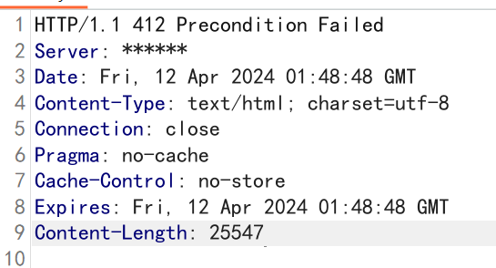

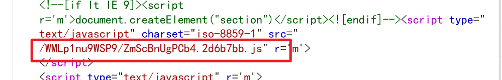

##### 2、访问请求和Cookie中带有动态加密的字符

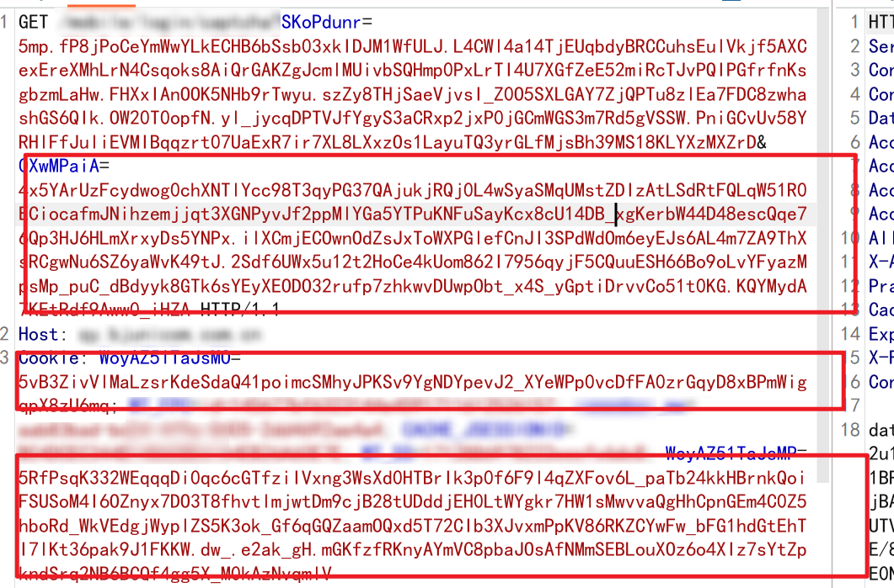

##### 3、重发请求时会返回400状态码

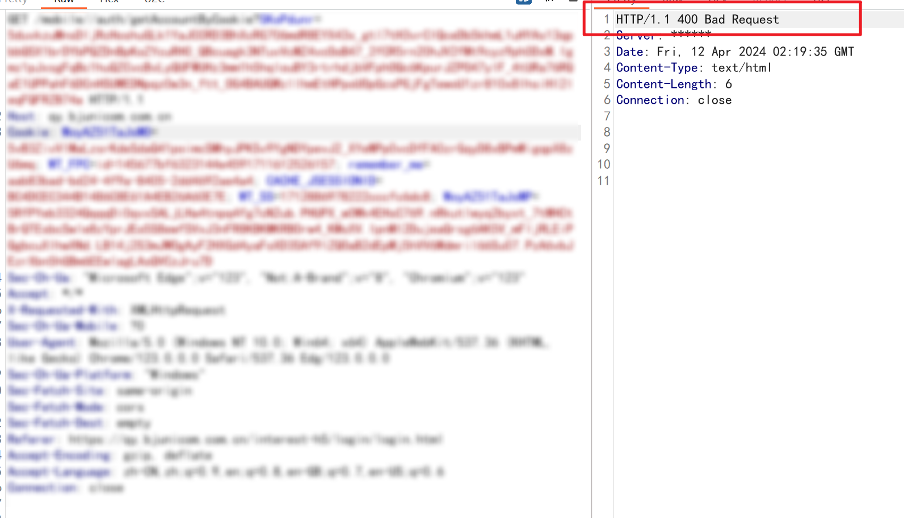

## 工具使用

### 前置准备

```
python3环境
所需的第三方库（pip install -r requirements.txt）
注意：版本不能过低（会有未知BUG）
注：程序默认使用到8765、8081、3000端口，如有端口冲突自行修改端口
```

装完三方库后，需要安装C:\Users\【用户名】\mitmproxy目录中mitmproxy-ca-cert.cer证书

### 使用方式

#### 1、启动server程序

```
python server.py
或
start_server.bat
```

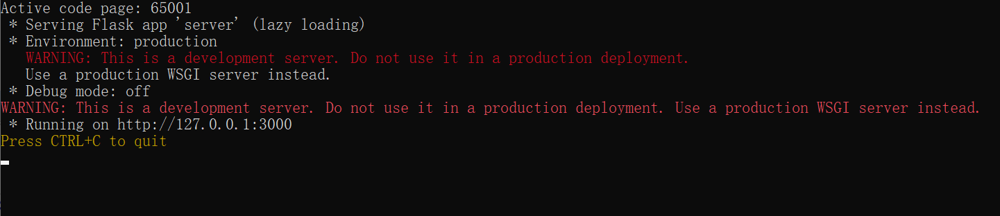

#### 2、执行mitmdump脚本

##### 使用mitmdump自动添加js（适合所有网站环境）

1、如访问网站非本机环境时，需要将ws通信地址修改成本机地址

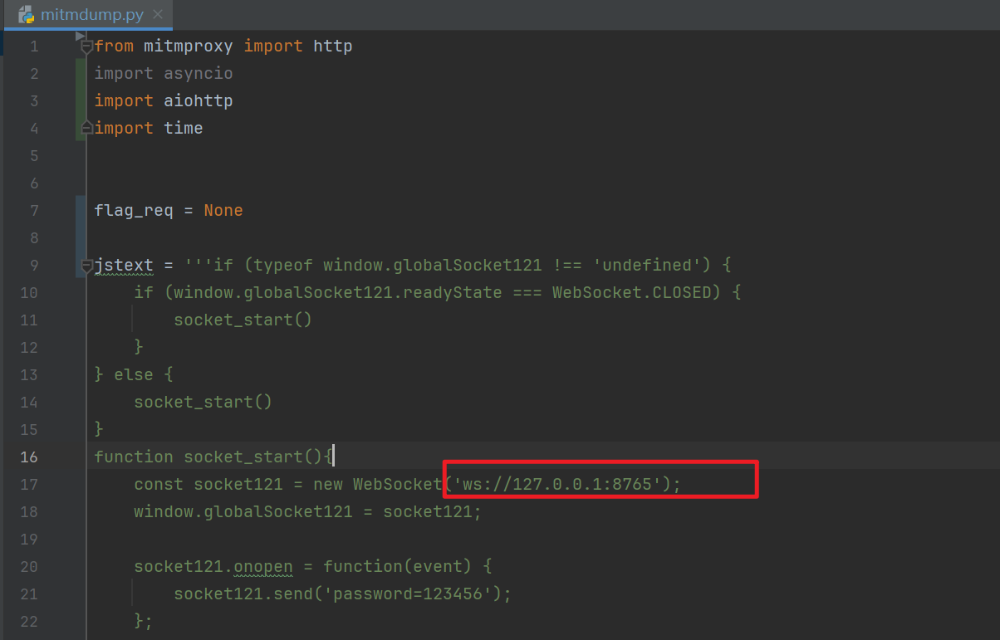

2、启动mitmdump

```
mitmdump -p 8081 -s mitmdump.py
或
mitmdump_start.bat
```

3、Burp添加上游代理

注意：不要只填*，会导致非目标网站执行js，影响正常使用。

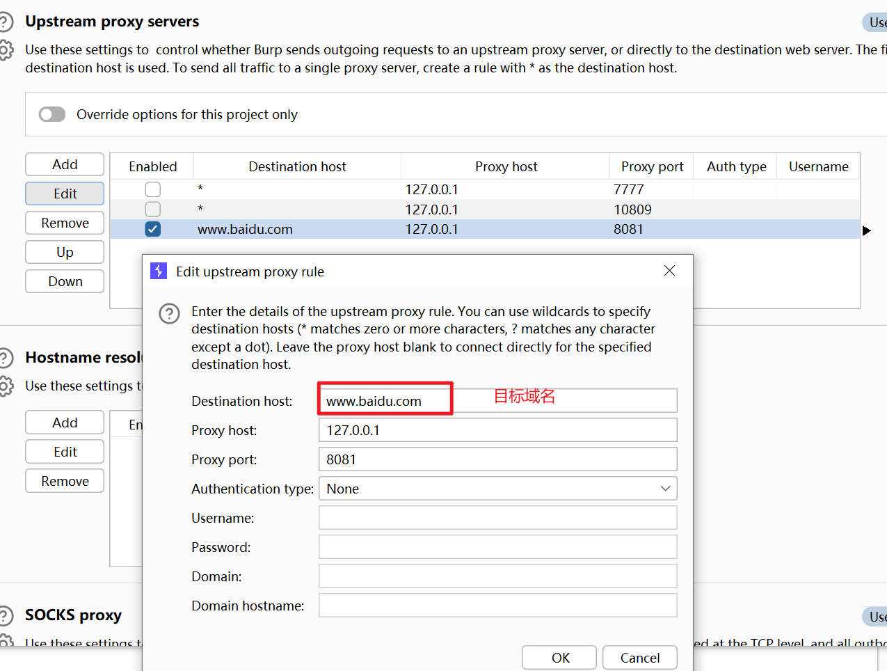

刷新目标网站，查看js和html地址内已自动添加指定js代码

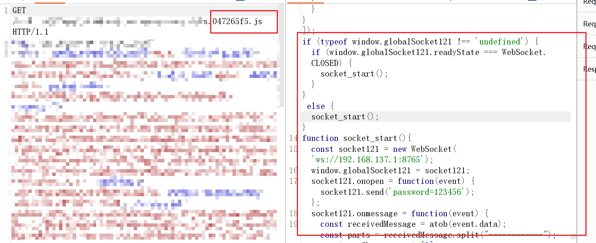

js代码执行成功，server端提示ws客户端连接成功，即可使用。

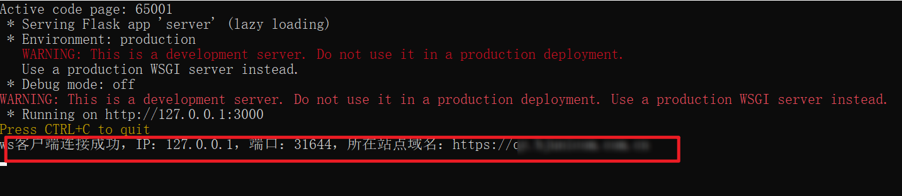

#### 3、进行重发请求

```
直接使用原请求包，header头中添加Req-flag: 1
```

例：

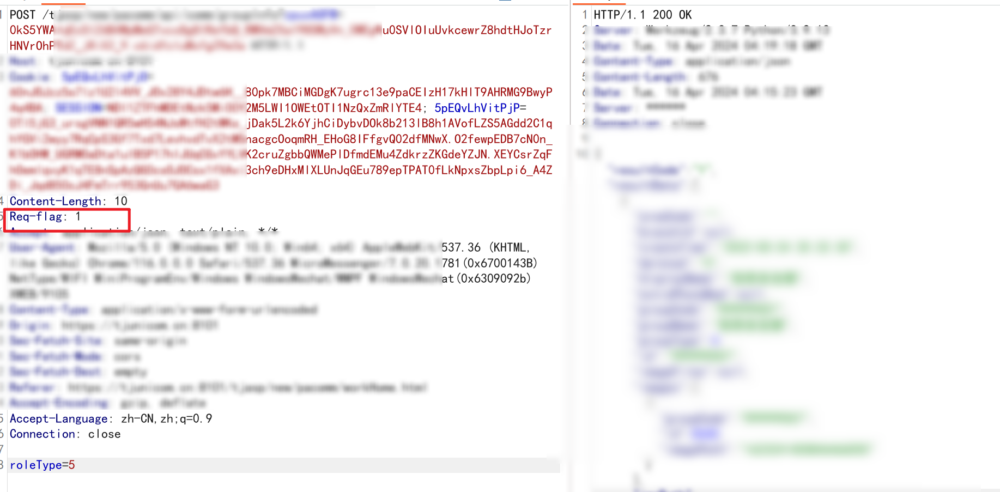

# 注意事项

```
1.默认网站响应超时时间2s
2.上游代理需指定域名或IP
3.批量请求时线程不要太大
4.目标非本机环境（例如：模拟器、手机）下需修改【mitmdump.py】内的127.0.0.1:8765修改成x.x.x.x:8765
```

如果遇到访问失败等情况

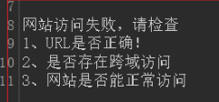

可以使用mitmdump-debug_start.bat，重发请求，到浏览器控制台查看报错，如果是代码问题可以提issues。

# 常见问题

1、安装三方库报错

```
根据自己python版本安装合适三方库的版本
```

1、请求后提示ws客户端未连接

```
1、代理挂上后刷新目标网站，查看js和html是否加载指定js。
2、该程序只将js、html网页增加了特殊js代码，目标网站如果默认没有请求js或html链接，则需使用其他方法解决，如：手动控制台执行mitmdump.py内的js
```

# 更新日志

##### 2024年4月25日

优化代码，解决已知BUG，更新v2.1版本

##### 2024年4月16日

更新v2.0版本

##### 2024年4月15日

修复已知问题

##### 2024年4月12日

v1.0版本发布

# 交流群

关注公众号【Tokaye安全】，发送加群。
