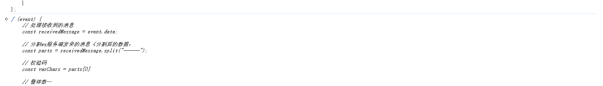
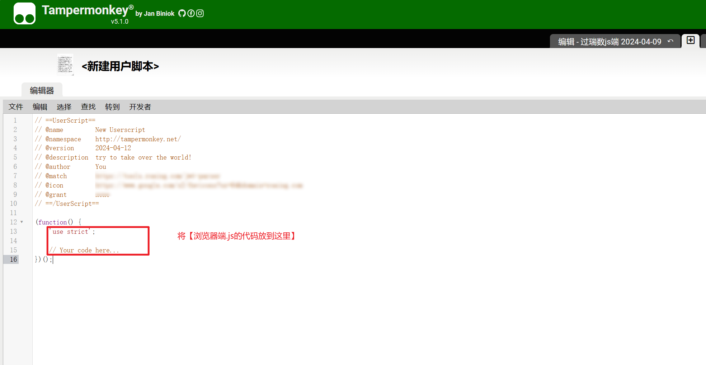

[TOC]

# Botgate_bypass

简介：绕过瑞数waf的动态验证机制，实现请求包重放，可针对不同网站使用。

## 瑞数waf？

### 简介

瑞数下一代WAF，即WAAP平台，以独特的“动态安全”为核心技术，以Bot防护为核心功能，结合智能威胁检测技术、行为分析技术，提供传统Web安全防御能力的同时，更能将威胁提前止于攻击的漏洞探测和踩点阶段，轻松应对新兴和快速变化的Bots攻击、0day攻击、应用DDoS攻击和API安全防护。

### 判断瑞数waf网站

##### 1、页面首次访问状态码412，页面中带有随机目录和文件名的js


##### 2、访问请求和Cookie中带有动态加密的字符


##### 3、重发请求时会返回400状态码


## 工具使用

### 前置准备

```
python3环境
所需的第三方库（pip install -r requirements.txt）
注意：版本不能过低（会有未知BUG）
```

### 使用方式

#### 1、启动server程序

```
python server.py
或
start_server.bat
```


#### 2、执行客户端JS代码

##### 方法一（建议）：使用mitmdump自动添加js（适合所有网站环境）

1、如访问网站非本机环境时，需要将ws通信地址修改成本机地址


2、启动mitmdump

```
mitmdump -p 8081 -s mitmdump.py
或
mitmdump_start.bat
```

3、Burp添加上游代理

注意：不要只填*，会导致非目标网站执行js，影响正常使用。


##### 方法二：手动执行js

在需要请求的网站上执行【浏览器端.js】中的代码，连接成功后server端会显示相关信息

（针对浏览器、小程序、微信浏览器、移动端、模拟器等环境，详见后面具体教程）




#### 3、进行重发请求

```
直接使用原请求包，header头中添加Req-flag: 1
```

例：


### 不同访问环境的使用

使用方法一不用看该情况

##### 浏览器

1、油猴插件

注意：为防止跨域问题，建议在@match位置填写目标域名，只在目标网站执行该脚本



2、手动在浏览器目标网站的控制台执行js代码

##### 小程序、微信浏览器、模拟器

1、使用WeChatOpenDevTools开启调试，在控制台执行js代码

2、Burp上游增加一层minmproxy，将每次的js或html响应中增加js代码（详见上面方法一）

注意：非本机环境需要将【浏览器端.js】中的ws地址修改

# 更新日志

##### 2024年4月16日

更新v2.0版本

##### 2024年4月15日

修复已知问题

##### 2024年4月12日

v1.0版本发布

# 交流群

关注公众号【Tokaye安全】，发送加群。
